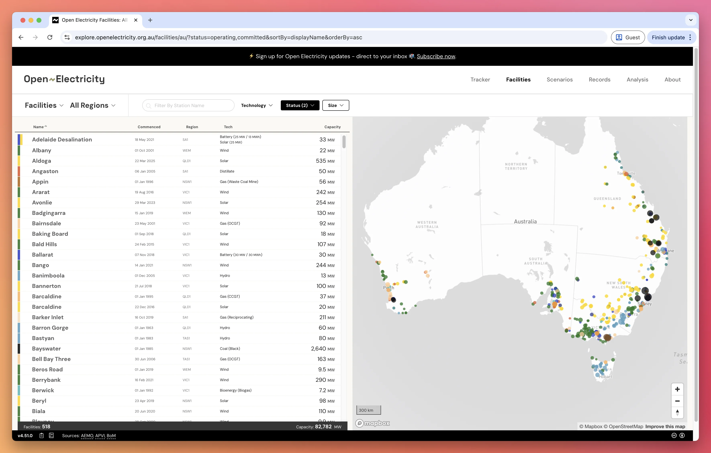
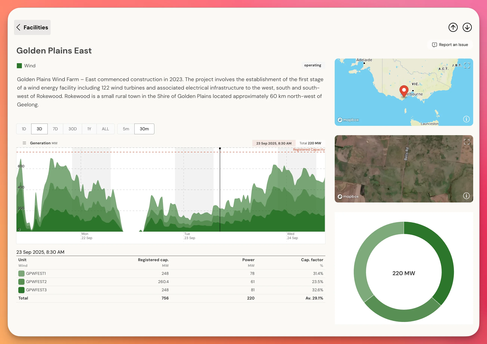

Australia's electricity network is made up of over 500 generation facilities in the National Electricity Market (NEM) and the Wholesale Electricity Market (WEM). These facilities have different fuel input technologies and generation profiles, and operate under various statuses from commissioning through to retirement.

The Open Electricity platform provides comprehensive tracking and analysis of these facilities, making this data accessible through both our interactive website and API.

## Understanding Facilities

### Network Structure

An electricity network consists of:
- **Multiple facilities** distributed across regions
- **Different fuel technologies** powering generation
- **Various operational statuses** (operating, commissioning, retired, etc.)
- **Geographic distribution** across states and territories

### Facility Composition

A single facility is made up of multiple generation units. Each unit:
- Has a specific [fuel technology type](/guides/fueltechs)
- Operates independently within the facility
- Can have different capacities and characteristics

Importantly, a facility can comprise units with a mixture of fuel technologies. For example:
- Solar + battery storage combinations
- Coal plants with diesel backup generators
- Wind farms with battery integration

## Exploring Facilities

Visit the [Open Electricity facilities explorer](https://explore.openelectricity.org.au/facilities/au/) to browse all Australian electricity generation facilities.



The facilities explorer provides powerful features to understand Australia's electricity infrastructure:

- **Browse all facilities** — View a comprehensive list of over 500 tracked facilities
- **Filter by fuel technology** — Select specific technologies like wind, solar, or coal
- **Filter by operating status** — Show only operating, retired, or commissioning facilities
- **Interactive map view** — See geographic distribution of generation assets
- **Capacity information** — View registered capacity for each facility
- **Technology mix** — Quickly identify the fuel technology for each facility
- **Regional distribution** — Understand generation capacity by state and region

Each row in the facilities list shows key information including facility name, location, region, technology type, and total capacity. Clicking on any facility takes you to its detailed page.

## Individual Facility Details

Each facility has a dedicated page with comprehensive information. For example, the [Golden Plains Wind Farm](https://explore.openelectricity.org.au/facility/au/NEM/GPWFEST/?range=3d&interval=30m):



The facility page displays:

- **Real-time generation** — Live power output graph showing generation patterns over time
- **Facility description** — Detailed information about the project and location
- **Interactive maps** — Both regional overview and satellite imagery of the actual facility
- **Unit breakdown** — Individual generation units with their specifications
- **Performance metrics**:
  - Registered capacity (MW) for each unit
  - Current power output (MW)
  - Capacity factor (%) showing utilisation
- **Time range controls** — View generation data over different periods (1D, 3D, 7D, 30D, 1Y, ALL)
- **Data intervals** — Adjust granularity from 5-minute to monthly intervals

## Facility Data Fields

### Facility Fields

| Field | Data Type | Description |
|-------|-----------|-------------|
| `code` | string | Unique facility identifier (e.g., `GPWFEST`) |
| `name` | string | Display name of the facility |
| `network_id` | string | Network the facility operates in (`NEM` or `WEM`) |
| `network_region` | string | Network region code (e.g., `VIC1`, `NSW1`) |
| `description` | string/HTML | Detailed facility description |
| `location` | object | Geographic coordinates (lat/lng) |
| `npi_id` | string | National Pollutant Inventory identifier |
| `units` | array | List of generation units within the facility |

### Unit Fields

| Field | Data Type | Description |
|-------|-----------|-------------|
| `code` | string | Unique unit identifier (e.g., `GPWFEST1`) |
| `fueltech_id` | string | [Fuel technology type](/guides/fueltechs) (e.g., `wind`, `solar_utility`) |
| `status_id` | string | Current operational status |
| `capacity_registered` | number | Registered generation capacity in MW |
| `capacity_maximum` | number | Maximum achievable capacity in MW |
| `capacity_storage` | number | Storage capacity for battery units in MWh |
| `emissions_factor_co2` | number | CO2 emissions factor (tonnes per MWh) |
| `dispatch_type` | string | Unit dispatch type (`GENERATOR`, `LOAD`, `BIDIRECTIONAL`) |
| `data_first_seen` | datetime | First time unit generation data appeared |
| `data_last_seen` | datetime | Most recent data point for unit generation data |
| `commencement_date` | datetime | When the unit commenced operation |
| `commencement_date_serialized` | string | Human-readable commencement date |
| `closure_date` | datetime | When the unit was closed |
| `closure_date_serialized` | string | Human-readable closure date |
| `expected_operation_date` | datetime | Expected date to begin operation |
| `expected_operation_date_serialized` | string | Human-readable expected operation date |
| `expected_closure_date` | datetime | Expected closure date |
| `expected_closure_date_serialized` | string | Human-readable expected closure date |
| `construction_start_date` | datetime | When construction began |
| `construction_start_date_serialized` | string | Human-readable construction start date |
| `project_approval_date` | datetime | When the project was approved |
| `project_approval_date_serialized` | string | Human-readable approval date |
| `project_lodgement_date` | datetime | When the project was lodged |
| `created_at` | datetime | When the unit record was created |
| `updated_at` | datetime | Last modification time |

Note: The serialized date fields provide human-friendly date formats that respect the level of date specificity available (e.g., "2024-08" for month-level precision, "2055" for year-only precision).

## Status Types

Generation units are tracked through various operational states:

- **Operating** — Currently generating electricity
- **Commissioning** — Being tested and prepared for operation
- **Committed** — Approved and contracted but not yet operating
- **Retired** — Permanently closed and no longer generating

## API Access

Facilities data is available through the Open Electricity API. The facilities endpoint provides programmatic access to all facility and unit information shown on the website.

For detailed API documentation and examples, see the [Facilities API Reference](/api-reference/facilities/get-facilities).

## Example API Response

Here's an example of facility data returned from the API:

```json
{
  "code": "GPWFEST",
  "name": "Golden Plains East",
  "network_id": "NEM",
  "network_region": "VIC1",
  "units": [
    {
      "code": "GPWFEST1",
      "fueltech_id": "wind",
      "status_id": "operating",
      "capacity_registered": 248,
      "dispatch_type": "GENERATOR",
      "commencement_date": "2024-09-01T00:00:00",
      "commencement_date_serialized": "2024-09",
      "expected_closure_date": "2055-01-01T00:00:00",
      "expected_closure_date_serialized": "2055"
    }
  ]
}
```

## Next Steps

Explore more about facilities, their technologies, and how to access their data programmatically.

<CardGroup cols={2}>
<Card
    title="Interactive Facilities Map"
    icon="map"
    href="https://explore.openelectricity.org.au/facilities/au/"
  >
    Explore the interactive facilities map to browse all Australian electricity generation facilities
  </Card>
  <Card
    title="Fuel Technologies"
    icon="plug"
    href="/guides/fueltechs"
  >
    Learn about different fuel technologies used in electricity generation
  </Card>
  <Card
    title="Facilities API"
    icon="code"
    href="/api-reference/facilities/get-facilities"
  >
    Access facility data programmatically via the Open Electricity API
  </Card>
  <Card
    title="Power Data"
    icon="lightbulb"
    href="/guides/power"
  >
    View real-time power data and understand power output patterns
  </Card>
</CardGroup>
