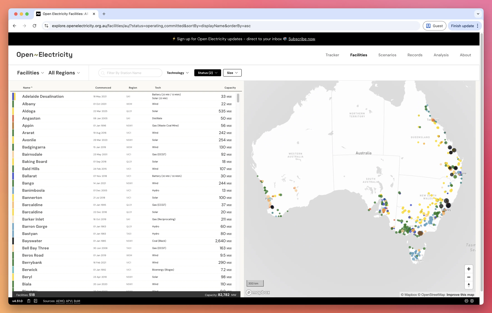
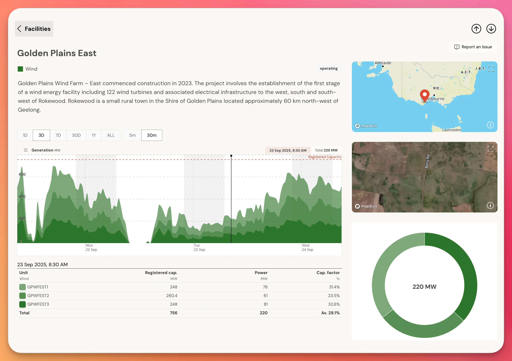

Australia's electricity network is made up of over 500 generation facilities in the National Electricity Market (NEM) and the Wholesale Electricity Market (WEM). These facilities have different fuel input technologies and generation profiles, and operate under various statuses from commissioning through to retirement.

The Open Electricity platform provides comprehensive tracking and analysis of these facilities, making this data accessible through both our interactive website and API.

## Understanding Facilities

### Network Structure

An electricity network consists of:
- **Multiple facilities** distributed across regions
- **Different fuel technologies** powering generation
- **Various operational statuses** (operating, commissioning, retired, etc.)
- **Geographic distribution** across states and territories

### Facility Composition

A single facility is made up of multiple generation units. Each unit:
- Has a specific [fuel technology type](/guides/fueltechs)
- Operates independently within the facility
- Can have different capacities and characteristics

Importantly, a facility can comprise units with a mixture of fuel technologies. For example:
- Solar + battery storage combinations
- Coal plants with diesel backup generators
- Wind farms with battery integration

## Exploring Facilities

Visit the [Open Electricity facilities explorer](https://explore.openelectricity.org.au/facilities/au/) to browse all Australian electricity generation facilities.



The facilities explorer provides powerful features to understand Australia's electricity infrastructure:

- **Browse all facilities** — View a comprehensive list of over 500 tracked facilities
- **Filter by fuel technology** — Select specific technologies like wind, solar, or coal
- **Filter by operating status** — Show only operating, retired, or commissioning facilities
- **Interactive map view** — See geographic distribution of generation assets
- **Capacity information** — View maximum capacity for each facility
- **Technology mix** — Quickly identify the fuel technology for each facility
- **Regional distribution** — Understand generation capacity by state and region

Each row in the facilities list shows key information including facility name, location, region, technology type, and total capacity. Clicking on any facility takes you to its detailed page.

## Individual Facility Details

Each facility has a dedicated page with comprehensive information. For example, the [Golden Plains Wind Farm](https://explore.openelectricity.org.au/facility/au/NEM/GPWFEST/?range=3d&interval=30m):



The facility page displays:

- **Real-time generation** — Live power output graph showing generation patterns over time
- **Facility description** — Detailed information about the project and location
- **Interactive maps** — Both regional overview and satellite imagery of the actual facility
- **Unit breakdown** — Individual generation units with their specifications
- **Performance metrics**:
  - Maximum capacity (MW) for each unit (see the [Capacity guide](/guides/capacity) for the distinction between maximum and registered)
  - Current power output (MW)
  - Capacity factor (%) showing utilisation
- **Time range controls** — View generation data over different periods (1D, 3D, 7D, 30D, 1Y, ALL)
- **Data intervals** — Adjust granularity from 5-minute to monthly intervals

## Facility Data Fields

### Facility Fields

| Field | Data Type | Description |
|-------|-----------|-------------|
| `code` | string | Unique facility identifier (e.g., `GPWFEST`) |
| `name` | string | Display name of the facility |
| `network_id` | string | Network the facility operates in (`NEM` or `WEM`) |
| `network_region` | string | Network region code (e.g., `VIC1`, `NSW1`) |
| `description` | string/HTML | Detailed facility description |
| `location` | object | Geographic coordinates (lat/lng) |
| `npi_id` | string | National Pollutant Inventory identifier |
| `units` | array | List of generation units within the facility |

### Unit Fields

| Field | Data Type | Description |
|-------|-----------|-------------|
| `code` | string | Unique unit identifier (e.g., `GPWFEST1`) |
| `fueltech_id` | string | [Fuel technology type](/guides/fueltechs) (e.g., `wind`, `solar_utility`) |
| `status_id` | string | Current operational status |
| `capacity_registered` | number | Registered generation capacity in MW |
| `capacity_maximum` | number | Maximum achievable capacity in MW |
| `capacity_storage` | number | Storage capacity for battery units in MWh |
| `emissions_factor_co2` | number | CO2 emissions factor (tonnes per MWh) |
| `dispatch_type` | string | Unit dispatch type (`GENERATOR`, `LOAD`, `BIDIRECTIONAL`) |
| `data_first_seen` | datetime | First time unit generation data appeared |
| `data_last_seen` | datetime | Most recent data point for unit generation data |
| `commencement_date` | datetime | When the unit commenced operation |
| `commencement_date_serialized` | string | Human-readable commencement date |
| `closure_date` | datetime | When the unit was closed |
| `closure_date_serialized` | string | Human-readable closure date |
| `expected_operation_date` | datetime | Expected date to begin operation |
| `expected_operation_date_serialized` | string | Human-readable expected operation date |
| `expected_closure_date` | datetime | Expected closure date |
| `expected_closure_date_serialized` | string | Human-readable expected closure date |
| `construction_start_date` | datetime | When construction began |
| `construction_start_date_serialized` | string | Human-readable construction start date |
| `project_approval_date` | datetime | When the project was approved |
| `project_approval_date_serialized` | string | Human-readable approval date |
| `project_lodgement_date` | datetime | When the project was lodged |
| `created_at` | datetime | When the unit record was created |
| `updated_at` | datetime | Last modification time |

Note: The serialized date fields provide human-friendly date formats that respect the level of date specificity available (e.g., "2024-08" for month-level precision, "2055" for year-only precision).

## Status Types

Generation units are tracked through various operational states:

- **Committed** — The facility has reached FID or started construction
- **Commissioning** — The facility has recorded generation and is yet to generate at 90% of its maximum capacity
- **Operating** — The facility has generated 90% of its maximum capacity and is currently generating
- **Retired** — Permanently closed and no longer generating

These definitions are unique to Open Electricity. The commissioning process can be broken down further into a series of tests conducted with AEMO and it is possible for facilities to be considered "operating" under Open Electricity's definition whilst still progressing through these commissioning steps. The commissioning process for each facility is not comprehensively documented and made public by AEMO, hence the difference in our definitions. For more information on AEMO's process, visit [here](https://www.aemo.com.au/energy-systems/electricity/national-electricity-market-nem/participate-in-the-market/network-connections/connections-scorecard).

There are facilities that may behave unusually despite being considered operating by Open Electricity. Consider the Eraring BESS. The battery reached 90% of maximum capacity in September 2025, but only completed AEMO's commissioning process in [December 2025](https://www.originenergy.com.au/about/who-we-are/what-we-do/generation/eraring-projects/battery/).  We can see very low generation in October and November as the battery is not operating as a commissioned facility despite it meeting the Open Electricity threshold.


On the other hand, there are facilities that will operate in a reasonable manner and contribute considerably to the grid despite not being commissioning by AEMO's definition. Consider the Gangarri Solar Farm. The facility officially reached full output according to AEMO in [Q1 2025](https://www.aemo.com.au/-/media/files/electricity/nem/network_connections/connections-scorecard/2025/march-2025.pdf?rev=fba164b227c848abafe9cfa0176658a3&sc_lang=en), though it had generated at considerable rates for years prior. In fact, in October 2023, it had generated more electricity than during any month in 2025. 


As such, the 90% of maximum capacity is a useful threshold to give an indication of the amount of capacity available to the grid, capacity factor calculations and similar uses. The commissioning status given by Open Electricity is indicative and users may find alternative definitions better suit their purposes.


## API Access

Facilities data is available through the Open Electricity API. The facilities endpoint provides programmatic access to all facility and unit information shown on the website.

For detailed API documentation and examples, see the [Facilities API Reference](/api-reference/facilities/get-facilities).

## Example API Response

Here's an example of facility data returned from the API:

```json
{
  "code": "GPWFEST",
  "name": "Golden Plains East",
  "network_id": "NEM",
  "network_region": "VIC1",
  "units": [
    {
      "code": "GPWFEST1",
      "fueltech_id": "wind",
      "status_id": "operating",
      "capacity_registered": 248,
      "dispatch_type": "GENERATOR",
      "commencement_date": "2024-09-01T00:00:00",
      "commencement_date_serialized": "2024-09",
      "expected_closure_date": "2055-01-01T00:00:00",
      "expected_closure_date_serialized": "2055"
    }
  ]
}
```

## Next Steps

Explore more about facilities, their technologies, and how to access their data programmatically.

<CardGroup cols={2}>
<Card
    title="Interactive Facilities Map"
    icon="map"
    href="https://explore.openelectricity.org.au/facilities/au/"
  >
    Explore the interactive facilities map to browse all Australian electricity generation facilities
  </Card>
  <Card
    title="Fuel Technologies"
    icon="plug"
    href="/guides/fueltechs"
  >
    Learn about different fuel technologies used in electricity generation
  </Card>
  <Card
    title="Facilities API"
    icon="code"
    href="/api-reference/facilities/get-facilities"
  >
    Access facility data programmatically via the Open Electricity API
  </Card>
  <Card
    title="Power Data"
    icon="lightbulb"
    href="/guides/power"
  >
    View real-time power data and understand power output patterns
  </Card>
</CardGroup>
